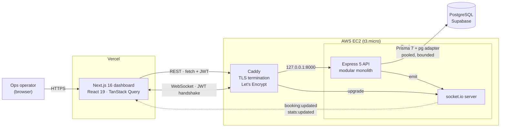
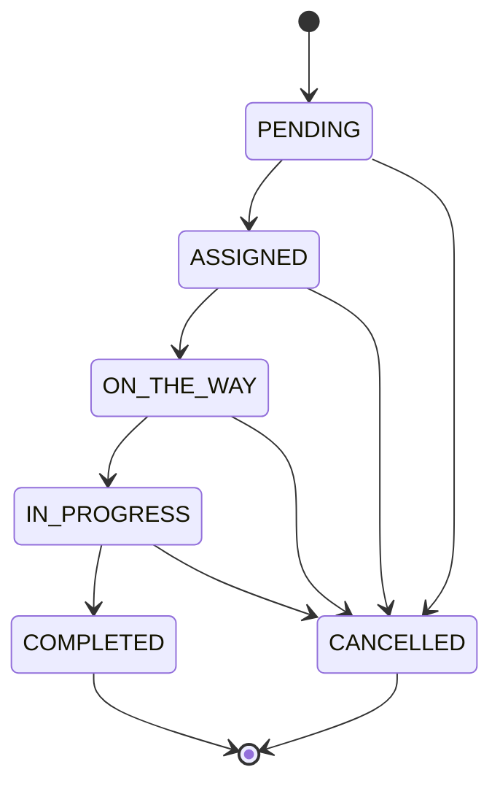

# Instant Mechanic — Operations Dashboard

An internal operations dashboard for a vehicle-service business. It gives the ops team one
screen that answers *"what is happening right now, and what needs a human?"* across bookings,
mechanics, customers and revenue — and lets an operator dispatch a mechanic to a job.

It is a monitoring and dispatch surface over operational data. Not a customer-facing product,
and not an automation: the system computes and displays, every state change is an explicit
operator action.

### HLD


The conceptual shape. The [Architecture](#architecture) diagram below shows the same system as
deployed — Vercel, EC2, Caddy and TLS.

---

## Tech stack

| Layer | Choice | Why |
|---|---|---|
| Frontend | Next.js 16 (App Router), React 19, TypeScript | Server components for the shell, client components where the data is live |
| UI | Tailwind v4, shadcn (`base-luma` on `@base-ui/react`), lucide, Recharts | One accent colour, semantic status colours, restrained for eight-hour use |
| Data fetching | TanStack Query | Cache keyed by every filter, so invalidation is precise |
| Realtime | socket.io (client + server) | Push, not polling; JWT-gated handshake |
| Backend | Node 22, Express 5, TypeScript | Modular monolith, vertical slices |
| ORM | Prisma 7 with `@prisma/adapter-pg` | Driver adapters; the `pg` pool owns connection behaviour |
| Database | PostgreSQL (Supabase) | Managed, free tier |
| Validation | Zod 4 | Same library validates requests *and* the environment |
| Auth | JWT (`jsonwebtoken`) + bcryptjs | Stateless, 7-day expiry |
| Logging | pino + pino-http | Structured, with redaction of secrets and PII |
| Tests | Vitest + Supertest | 88 integration tests against a real database |
| Docs | OpenAPI 3.0 + swagger-ui-express | Served at `/api/docs` |
| Deploy | Docker (multi-stage) + Caddy on EC2; Vercel | TLS is mandatory — see below |

---

## Architecture



### Request path through the backend

Dependency direction is inward, and each layer may only call the next:

```
routes → controller → service → repository → Prisma
```

- **routes** — URL shapes, middleware wiring, zod validation
- **controller** — HTTP in, HTTP out. Never touches Prisma
- **service** — business rules: the booking state machine, transactions, cache invalidation, socket emits
- **repository** — the **only** layer that touches Prisma

A feature owns its whole stack in one folder:

```
backend/src/modules/bookings/
  bookings.routes.ts  bookings.controller.ts  bookings.service.ts
  bookings.repository.ts  bookings.schema.ts
```

### Booking state machine

Status may only move along these edges. Anything else is a `409` naming the current status and
the legal next ones — arbitrary status writes are not accepted.



Every transition happens in one transaction that updates the booking, appends an immutable
`BookingEvent`, adjusts the mechanic's status and `jobsCompleted`, invalidates the dashboard
cache, and emits `booking:updated` + `stats:updated`.

---

## Rules the code actually enforces

These are not aspirations; each has a test that fails if it stops being true.

1. **Aggregates are computed in SQL over the full filtered set.** Never by summing a page in
   JS. A revenue total reflecting only page 1 looks real and is wrong, and ops makes money
   decisions on it. `tests/integration/aggregates.test.ts` asserts the reported total does
   *not* equal the sum of page 1.
2. **Revenue counts `COMPLETED` bookings only.** Cancelled bookings count toward booking
   totals but never toward money.
3. **Dispatch is idempotent, enforced by a `UNIQUE (bookingId, mechanicId)` index** plus a
   transaction — not an application-level check-then-write, which races. A double-clicked
   assign must not send two mechanics to one job.
4. **`sort` is checked against a per-endpoint allowlist** and rejected with `400`, never
   interpolated into a query.
5. **Money crosses the wire as a decimal string**, never a JSON float.
6. **No secrets or customer PII in logs or error responses.** pino redaction is configured in
   `lib/logger.ts`; error bodies carry a code and a safe message, never a stack in production.
7. **The frontend never touches Prisma.** Only `backend/` holds a database connection.

---

## Local setup

Prerequisites: Node 22+, a PostgreSQL database (Supabase free tier is fine).

```bash
git clone <your-repo-url> instant-mechanic
cd instant-mechanic
```

### Backend

```bash
cd backend
npm install
cp .env.example .env          # then fill in DATABASE_URL and JWT_SECRET
openssl rand -base64 48       # paste as JWT_SECRET

npx prisma generate
npx prisma migrate deploy     # or apply prisma/migrations/*/migration.sql by hand
npm run db:seed               # 2 users, 60 customers, 25 mechanics, 650 bookings

npm run dev                   # http://localhost:8000
```

> If `migrate deploy` hangs, your Postgres is behind a connection pooler that does not grant
> advisory locks (Supabase's does not). Apply the migration SQL through the provider's SQL
> editor instead.

### Frontend

```bash
cd frontend
npm install
cp .env.example .env.local     # NEXT_PUBLIC_API_URL=http://localhost:8000
npm run dev                    # http://localhost:3000
```

Sign in with the seeded credentials, which the login page also displays:

| Role | Email | Password |
|---|---|---|
| Admin | `admin@instantmechanic.com` | `Password123!` |
| Ops | `ops@instantmechanic.com` | `Password123!` |

### Live demo data

```bash
cd backend && npm run simulate     # run INSTEAD of `npm run dev`
```

Advances a real booking every 4 seconds and pushes each change over the socket, so the
dashboard visibly moves. It is the same API server plus a loop — socket.io holds connections
in memory, so a separate process could not push to clients attached to the API.

---

## Environment variables

### `backend/.env`

| Variable | Required | Description |
|---|---|---|
| `DATABASE_URL` | yes | Postgres connection string. Params `connection_limit`, `pool_timeout`, `connect_timeout` are translated into real `pg` pool options — the database is reached over the public internet, so every wait is bounded. |
| `JWT_SECRET` | yes | Signing key for operator sessions. Minimum 32 chars; generate with `openssl rand -base64 48`. |
| `PORT` | no (8000) | Port the API listens on. Never exposed publicly — Caddy proxies to it. |
| `NODE_ENV` | no (development) | `production` strips stack traces from error responses. |
| `CORS_ORIGIN` | no | Comma-separated allowlist of browser origins. The exact Vercel URL. **Never `*`** — these responses carry customer PII. |
| `SEED_ADMIN_EMAIL` / `SEED_ADMIN_PASSWORD` / `SEED_ADMIN_NAME` | no | Used only by `npm run db:seed` to create the first ADMIN. |
| `TEST_DATABASE_URL` | no | Overrides the test target. Defaults to `DATABASE_URL` with `?schema=im_test`. |

Everything is validated by zod at import time — a missing or malformed value stops the
process at boot with a readable list, rather than failing later on a request.

### `frontend/.env.local`

| Variable | Required | Description |
|---|---|---|
| `NEXT_PUBLIC_API_URL` | yes | Base URL for REST and WebSocket. **Inlined at build time** — changing it on Vercel needs a redeploy, not a restart. Must be `https://` in production. |

---

## API documentation

Full OpenAPI 3.0 spec, browsable: **`GET /api/docs`** — <http://localhost:8000/api/docs>
(publicly reachable; it describes the contract, not data). Raw document at
`/api/docs/openapi.json`, source in `backend/openapi.yaml`.

Every list endpoint accepts `page`, `limit`, `sort`, `order`, `search` and returns:

```json
{ "data": [], "meta": { "page": 1, "limit": 20, "total": 0, "totalPages": 0 } }
```

`total` is a `COUNT` over the full filtered set, not the length of `data`.

| Method | Endpoint | Auth | Purpose |
|---|---|---|---|
| GET | `/api/health` | — | Liveness + `SELECT 1` DB probe under a 2s timeout. 503 when the DB is down |
| GET | `/api/docs` | — | Swagger UI |
| POST | `/api/auth/login` | — | Credentials → JWT. 5 failed attempts / 15 min / IP |
| POST | `/api/auth/register` | ADMIN | Create an operator |
| GET | `/api/auth/me` | any | Current user from the token |
| POST | `/api/auth/logout` | any | Advisory — JWTs are stateless |
| GET | `/api/dashboard` | any | The 8 overview cards + % deltas. Cached 30s, invalidated on any booking write |
| GET | `/api/analytics/bookings-over-time` | any | `?range=7d\|30d\|90d`, zero-filled |
| GET | `/api/analytics/revenue-over-time` | any | Same, COMPLETED only |
| GET | `/api/analytics/status-breakdown` | any | Counts + percentages |
| GET | `/api/analytics/service-breakdown` | any | Counts + revenue by category |
| GET | `/api/bookings` | any | Filter by status, mechanic, category, date range; search code/customer/reg |
| POST | `/api/bookings` | any | Create in PENDING, allocate `BK-#####` |
| GET | `/api/bookings/:id` | any | Booking + relations + full audit timeline |
| PATCH | `/api/bookings/:id/status` | any | State-machine guarded; illegal → 409 |
| PATCH | `/api/bookings/:id/assign` | any | Idempotent dispatch |
| GET | `/api/mechanics` | any | Each row carries its current/last booking, resolved in one query |
| GET | `/api/mechanics/:id` | any | Detail + recent bookings |
| PATCH | `/api/mechanics/:id/status` | any | Availability; refuses OFF_DUTY with live jobs |
| GET | `/api/customers` | any | With `bookingCount` and `totalSpent` |
| GET | `/api/customers/:id` | any | Detail + vehicles + history |

Errors are `{ "error": { "code", "message", "details?" } }`. Codes: `VALIDATION_ERROR` (400),
`UNAUTHORIZED` (401), `FORBIDDEN` (403), `NOT_FOUND` (404), `CONFLICT` (409),
`TOO_MANY_REQUESTS` (429), `INTERNAL_ERROR` (500), `DATABASE_UNAVAILABLE` (503).

---

## Tests

```bash
cd backend && npm test
```

88 integration tests hitting the real Express app through Supertest against a real Postgres.

They run in a dedicated `im_test` **schema**, never the development data. The guard is not
just the URL: `resetAndSeed` asserts the schema Prisma is *actually* writing to before it
truncates anything, because under Prisma 7 driver adapters `?schema=` on the connection
string is inert unless it is also passed to the adapter — and getting that wrong silently
points a truncating test suite at the working database.

Covered: health, auth (including identical responses for unknown-email and wrong-password),
role enforcement, dashboard shape and the revenue rule, zero-filled time series, percentages
summing to 100, pagination, search across three fields, filters ANDing, sort-column rejection,
404s, every state-machine edge, one audit row per transition, dispatch idempotence (sequential
*and* five concurrent requests), aggregate correctness, and N+1 absence asserted by query count.

---

## Deployment

Full copy-pasteable guide: **[DEPLOYMENT.md](./DEPLOYMENT.md)**. In outline:

1. Launch a free-tier `t3.micro` Ubuntu EC2. Security group opens **22, 80, 443 only** — never
   8000; the API binds to `127.0.0.1` and only Caddy reaches it.
2. Install Docker + the compose plugin. Add 2 GB swap (1 GB RAM will OOM a build).
3. Clone, `cp .env.example .env`, fill in `DATABASE_URL` / `JWT_SECRET` / `CORS_ORIGIN`.
4. `docker compose up -d --build`, then `npx prisma migrate deploy`.
5. **Put Caddy in front for TLS.** This is not optional: Vercel serves the dashboard over
   HTTPS, and a browser blocks every request *and* every WebSocket to a plain-HTTP backend as
   mixed content. The dashboard renders and then sits completely dead with only a console
   error. No domain? `api.<your-ip-with-dashes>.sslip.io` resolves already, so Let's Encrypt
   will issue a real certificate for it.
6. Vercel: import the repo, **root directory `frontend`**, set `NEXT_PUBLIC_API_URL` to the
   `https://` backend URL.
7. Set `CORS_ORIGIN` to the exact Vercel origin and `docker compose up -d`.

The API handles `SIGTERM` by refusing new connections, closing websockets, draining in-flight
requests and disconnecting Prisma, so a redeploy does not cut an operator off mid-dispatch.

---

## AI usage

**This project was scaffolded and planned using System design and HLD. Then created scaffolded the file/folder architecture. Using AI to write the**
- frontend
- schema
- logger and error handling
- basic routes

**Modified by hand.** Project scaffold, planning, creating architecture, file  and folders,
- writing controllers
- creating prisma using documentation
- creating middleware and main path
- selecting and planning packages
- removing AI redundancy
- creating docker image using docker init and docker compose

**What the AI did.** After the planning and understanding phase. Used AI for the Frontend, schema, tests, seed. This allowed faster developement and clean architecture using genesis kit to do loop development using ai With iterations

**How it was directed.** Using genesis kit and claude code with simple loop and iterations. Using step by step prompting based on the plan about what needs to be implemented.
1. schema
2. seed
3. tests
4. frontend

**What it verified rather than claimed.** Every prompt ended with a demonstration: run the
command, paste the exit code. Endpoints were exercised with real `curl` against the live
database, the frontend was driven in a real browser, and the test suite runs against real
Postgres. Several bugs were caught this way and are recorded below.

**Bugs the AI found in the pre-existing scaffold** — none of these were reported by a
typecheck or a linter:

- `Dockerfile` pinned `node:22.23.2-alpine`, a tag that does not exist, and never ran `tsc`
  while `dist/` was in `.dockerignore` — the image could not have contained the file its `CMD`
  told it to run.
- `frontend/app/[root]/page.tsx` was a catch-all route occupying `/`; combined with a
  `(dashboard)` route group, Next 16 emitted **both** into the manifest with no build error and
  silently served the wrong one.
- `backend/package.json` had `"postinstall": "prisma skills sync || exit 0"` — not a real
  command, run on every install, failure swallowed.
- `prisma` was at `8.0.0-rc.12` against `@prisma/client` at `7.10.0`.

**Bugs the AI introduced and then caught by testing** — worth listing, because they are the
honest cost of the approach:

- The auth guard redirected signed-in users to `/login` on any hard navigation, because
  `useSyncExternalStore` returns the *server* snapshot during hydration. Found by driving the
  real browser; curl could never have seen it.
- The first version of the test suite wrote into the development database. `?schema=` on a
  Prisma 7 connection string is inert unless also passed to the driver adapter, so the tests
  truncated and reseeded `public`. Caught within one run, the data restored exactly, and the
  guard rewritten to assert where Prisma actually writes.
- A `compose.yaml` that made the API wait on a Postgres container it never queried.


